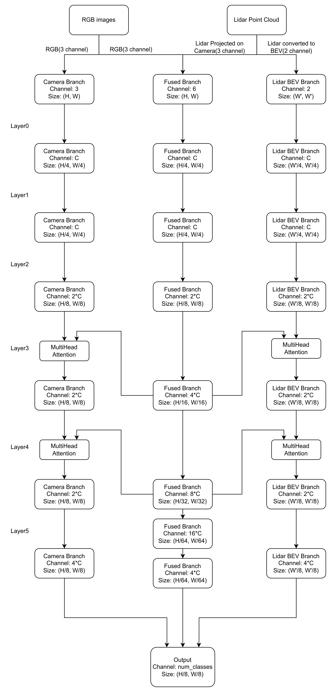

# DeepMIA: Multi-Modal Autonomous Driving System

This repository contains my undergraduate research work on semantic segmentation for autonomous driving using multi-modal sensor fusion (RGB cameras and LiDAR) in the CARLA simulator. The project extends the [TransFuser](https://arxiv.org/abs/2205.15997) framework with custom architectures for semantic segmentation.

> **For detailed research notes, literature reviews, and paper summaries, visit the [Research Notes](https://erkamkavak.notion.site/deepmia-research) page.**  
*Written by Erkam Kavak and Emir Kısa (for internal works, not cured or maintained)*

## Purpose

Our goal is to build a robust autonomous driving system that effectively fuses multiple sensor modalities to achieve safe, high-performance driving in complex urban scenarios.

**Key Challenge**: Most existing methods (e.g., TransFuser) only use LiDAR in Bird's-Eye-View (BEV) format, losing valuable 3D spatial information. We explore whether using LiDAR in both BEV and camera-projected formats improves perception and driving performance.


## Proposed Architecture



*Three-branch multi-modal fusion architecture: Camera Branch (left), Fused Branch (center), and LiDAR BEV Branch (right). Multi-head attention modules enable cross-modal feature interaction at multiple network depths.*

## Rationale

### 1. **Three-Branch Architecture Rationale**

**Problem with existing methods**: Most LiDAR-camera fusion approaches (e.g., TransFuser) use only two branches: one for LiDAR BEV features and one for camera features. However, BEV representation loses valuable 3D spatial information inherent in raw LiDAR point clouds.

**Our approach**: We introduced a third branch that processes camera-projected LiDAR features, allowing us to:
- Preserve LiDAR's 3D context through projection onto camera views
- Enable pixel-wise cross-attention between camera and LiDAR features
- Avoid 3D computational complexity while maintaining spatial relationships

**Tradeoff**: Projecting LiDAR to 2D loses some 3D geometric information, but gains computational efficiency and enables more effective 2D fusion for semantic segmentation tasks.

### 2. **Cross-Attention vs. Simple Concatenation**

**Limitation of TransFuser's attention**: TransFuser concatenates camera and LiDAR features without proper conditioning, which limits fusion effectiveness.

**Our solution**: We explored cross-attention mechanisms (`MultiSpatialTransformer`, `FusedLidarAttention`) that:
- Build relationship maps between different feature spaces
- Selectively attend to relevant features rather than blindly concatenating
- Enable pixel-wise information transfer when features are spatially aligned

**Insight from YOLOv5 experiments**: We found that simple concatenation (Concat blocks) is less effective than attention-based fusion. Upsampling operations can also introduce artifacts, making attention-based fusion more reliable.

### 3. **LiDAR Projection Strategy**

**Why project LiDAR to camera view?**
- **Easier data transfer**: Camera and projected LiDAR share the same 2D spatial structure
- **Computational efficiency**: 2D convolutions are faster and simpler than 3D operations
- **Output alignment**: Semantic segmentation outputs are 2D, so 3D information becomes redundant
- **Cross-attention compatibility**: Pixel-wise attention requires spatial alignment

**Architecture details**: 
- Camera branch uses frozen SAM (Segment Anything Model) layers (12 layers, pretrained)
- LiDAR branch uses ResNet (4 layers)
- Layer matching: 1 ResNet layer processes alongside 3 SAM layers to maintain feature alignment

### 4. **Learning from Other Vehicles (LAV Analysis)**

**Insight from LAV**: Learning from surrounding vehicles provides diverse driving scenarios without additional data collection.

**Caveats we identified**:
- **Sensor failure sensitivity**: Any sensor failure or noisy input directly affects learning, as the model learns from observed (potentially incorrect) vehicle movements
- **Distance limitations**: Sensors provide unreliable data beyond certain distances, so learning from distant vehicles reduces performance
- **Weather dependency**: In adverse conditions (e.g., snow), noisy sensor data leads to incorrect learning from other vehicles' movements

**Our approach**: We focus on robust sensor fusion rather than learning from potentially unreliable observations of other vehicles.

### 5. **Multi-Level Fusion Strategy**

**Design choice**: We fuse features at multiple network depths (layers 1-4) rather than only at the end.

**Rationale**: 
- Early fusion captures low-level geometric correspondences
- Late fusion captures high-level semantic relationships
- Multi-level fusion combines both, improving feature representation

**Implementation**: Features are shared between branches at each level via cross-attention, then aggregated through Pyramid Pooling Module (PPM) for final prediction.

## Preliminary Results

**Note**: Project is still under development. Results are preliminary and not final.

### Performance on CARLA NoCrash Benchmark

| Method | Avg. Driving Score ↑ | Avg. Route Completion ↑ | Avg. Infraction Penalty ↓ | Collisions (Veh.) ↓ | Collisions (Ped.) ↓ | Red Light ↓ | Stop Sign ↓ | Off-road ↓ |
|--------|---------------------|------------------------|--------------------------|-------------------|-------------------|------------|------------|-----------|
| **PIDNetLidarv2 (Ours)** | **74.49** | 82.71 | 0.894 | 0.064 | 0.015 | 0.022 | 0.143 | 0.000 |
| TransFuser (2022) | 61.18 | 86.69 | 0.71 | – | – | – | – | – |
| LAV (2022) | 61.85 | **94.46** | **0.64** | – | – | – | – | – |

### Key Findings

- **Higher Driving Score**: Our system achieves **+13.3 points** over TransFuser and **+12.6 points** over LAV
- **Low Collision Rates**: Vehicle collisions (0.064) and pedestrian collisions (0.015) are well-controlled
- **Route Completion**: Lower than LAV (82.71% vs 94.46%), but still competitive

## Quick Training and Eval

```bash
# Setup
conda env create -f environment.yml
conda activate tfuse
cd team_code_transfuser && pip install -r requirements.txt

# Train semantic segmentation model
cd segmentation
python train_seg.py --model-name pidnet_lidar_v2 --num-epoch 50 --batch-size 16

# Evaluate
python eval_seg.py --model-type pidnet_lidar_v2 --checkpoint-path ./outputs/.../best.pt
```


## Key Models

- **PIDNetLidarv2** (Custom): Three-branch multi-modal fusion
- **PIDNetLidar**: LiDAR fusion variant
- **PIDNetLidarSAM**: SAM-integrated variant
- **ERFNet, PIDNet**: Baselines for comparison


## Related Work

- [TransFuser](https://arxiv.org/abs/2205.15997) - Transformer-based sensor fusion
- [LAV](https://arxiv.org/abs/2203.02424) - Learning from all vehicles
- [PIDNet](https://arxiv.org/abs/2206.02066) - Real-time segmentation network
- [CARLA Simulator](https://carla.org/)
